# 论文图像复现

本文档对应论文：**Sensitivity study of the charged lepton flavor violating process $\tau \to \gamma\mu$ at STCF**（arXiv:2305.00483）。

使用 STCF 全模拟链（KKMC + EvtGen + 探测器模拟 + 重建 + 分析算法）复现论文中的分析流程，并由 `plotting/plot_paper_figs.py` 生成以下图像。当前复现结果与论文仍存在差异，主要集中在三种标记道的 tag 上。

---
我的所有程序源代码在 `PROJECT_CODE_DUMP.md` 中，其中 `TauMuGammaAna.cc` 是核心的筛选算法，在算法最后的 `finalize()` 部分有cutflow 流程
```cpp
bool TauMuGammaAlg::finalize() {
    // ========================================================================
    //                         CUT FLOW 详细说明
    // ========================================================================
    // 本 cutflow 按照 execute() 中的事例选择顺序记录各阶段的失败计数。
    // 早期选择（nCharged、qsum、nGamma、PID）是互斥的：事例在第一个失败点退出。
    // 运动学 cut（kin_*）和 Table-1 进一步选择（e_*、pi_*、rho_*）是非互斥的：
    // 同一事例可能同时失败多个 cut，均会计入对应计数器。
    // 参考论文中的 Table 1（各 tag 模式的进一步选择条件）
    // ========================================================================

    LogInfo << "TauMuGammaAlg summary:\n"

    // ------------------------------------------------------------------------
    // 基本统计
    // ------------------------------------------------------------------------
            << "  All events     : " << m_evtAll << "\n"
            //   总处理事例数

            << "  Pass basic     : " << m_evtPassBasic << "\n"
            //   通过基础运动学选择的事例数
            //   条件: cos(θ_γμ) < -0.35 AND p_μ ∈ [0.4, 1.7] GeV/c AND E_γ ∈ [0.4, 1.7] GeV

            << "  Pass final fill: " << m_evtPassFinal << "\n"
            //   通过所有选择（包括 Table-1 tag 模式特定 cut）并填入 ntuple 的事例数

    // ------------------------------------------------------------------------
    // 早期选择失败（互斥：事例在第一个失败点退出）
    // ------------------------------------------------------------------------
            << "  Fail no rec/shower: " << m_fail_noRecOrShower << "\n"
            //   无 ReconstructedParticleCol 或 RecECALShowerCol
            //   → 数据读取失败，无法进行分析

            << "  Fail nCharged     : " << m_fail_nCharged << "\n"
            //   带电径迹数不满足要求
            //   严格模式 (analysisMode=0): 要求 nCharged == 2
            //   robust模式 (analysisMode=1): 要求 nCharged >= 2
            //   筛选条件: |p| >= chargedPmin (0.2 GeV/c), |cos θ| < 0.93

            << "  Fail qsum         : " << m_fail_qsum << "\n"
            //   严格模式下净电荷 ≠ 0
            //   → 两条径迹电荷不相反（应为 +1 和 -1，总和为 0）

            << "  Fail nGamma       : " << m_fail_nGamma << "\n"
            //   光子候选数 < 1（经过 acceptance + 能量阈值 + 角度合并后无光子）
            //   接受度: barrel |cos θ| < 0.8, E > 25 MeV; endcap 0.86 < |cos θ| < 0.92, E > 50 MeV
            //   合并: 角度 < photonMergeAngleDeg (2°) 内的簇合并为一个

    // ------------------------------------------------------------------------
    // PID 失败（互斥：按诊断优先级计入第一个失败原因）
    // 双径迹配对循环：尝试所有 (mu, tag) 组合，选择 PID score 最高的配对
    // ------------------------------------------------------------------------
            << "  Fail PID no oppQ  : " << m_fail_pid_noOppCharge << "\n"
            //   无正负电荷相反的径迹对
            //   → 两条径迹同号，无法构成 (mu, tag) 配对

            << "  Fail PID mu-like  : " << m_fail_pid_noMuonLike << "\n"
            //   无径迹满足 μ 子 PID 条件
            //   条件: prob(μ) >= muPidMin (0.2) AND prob(μ) >= max(prob(e), prob(π)) - muPidSlack (0.05)

            << "  Fail PID mu E/p   : " << m_fail_pid_noMuonEop << "\n"
            //   μ 子候选未通过 E/p 选择（当前代码中此 cut 已禁用，始终通过）
            //   预留接口：若启用，要求 E/p < eoverpMuonMax (0.5)

            << "  Fail PID tag-like : " << m_fail_pid_noTagLike << "\n"
            //   无径迹满足 tag PID 条件（仅看 PID 概率，不看 E/p）
            //   条件: prob(e) 或 prob(π) 为三者中最大
            //   e-tag: prob(e) > prob(μ) AND prob(e) > prob(π)
            //   π-tag: prob(π) > prob(e) AND prob(π) > prob(μ)

            << "  Fail PID tag E/p  : " << m_fail_pid_noTagEop << "\n"
            //   tag 径迹满足 PID 但未通过 E/p 条件（仅在 useEoverPTagID=true 时生效）
            //   e-tag: 要求 E/p > eoverpElectronMin (0.8)
            //   π-tag: 要求 E/p < eoverpMuonMax (0.5)

            << "  Fail PID pair     : " << m_fail_pid_noPair << "\n"
            //   最终无有效 (mu, tag) 配对
            //   → 虽有正负电荷对、有 μ-like、有 tag-like，但无同时满足所有条件的组合

    // ------------------------------------------------------------------------
    // 信号光子选择失败
    // ------------------------------------------------------------------------
            << "  Fail rho sigG     : " << m_fail_rho_noSigG << "\n"
            //   ρ-tag 模式（π-tag + 找到 π⁰）下，扣除 π⁰ daughter光子后无剩余信号光子
            //   严格模式要求: 恰好剩 1 个光子作为信号光子；若为 0 则失败

            << "  Fail sigG exact   : " << m_fail_sigG_exact << "\n"
            //   非 ρ-tag 模式，严格模式要求恰好 1 个信号光子候选（排除 π⁰ daughter后）
            //   若候选数 ≠ 1（为 0 或 ≥ 2）则fail
            

            << "  Fail sigG none    : " << m_fail_sigG_none << "\n"
            //   信号光子选择后 sigG < 0，即最终未找到有效信号光子

    // ------------------------------------------------------------------------
    // 运动学 cut 失败（非互斥：同一事例可能多个 cut 都失败）
    // 这些是论文 Sec. 3 中 Fig. 2 所示的基础运动学选择
    // ------------------------------------------------------------------------
            << "  Fail kin cosMuG   : " << m_fail_kin_cosMuGamma << "\n"
            //   cos(θ_γμ) >= cosThetaMuGammaCut (-0.35)
            //   物理含义: 信号光子与 μ 子夹角不够大（应接近背靠背）

            << "  Fail kin pMu      : " << m_fail_kin_pMu << "\n"
            //   p_μ 不在 [pMuMin, pMuMax] = [0.4, 1.7] GeV/c 范围内
            //   物理含义: μ 子动量超出 τ → γμ 衰变的运动学允许范围

            << "  Fail kin EsigG    : " << m_fail_kin_EsigGamma << "\n"
            //   E_γ 不在 [EsigGammaMin, EsigGammaMax] = [0.4, 1.7] GeV 范围内
            //   物理含义: 信号光子能量超出 τ → γμ 衰变的运动学允许范围

    // ------------------------------------------------------------------------
    // Table-1 进一步选择失败: e-tag 模式 (tagMode=1)
    // 标记侧衰变为 τ⁺ → e⁺ νe ν̄τ
    // 主要本底: ditau（标记 τ 辐射衰变产生的光子被误认为信号光子）
    // ------------------------------------------------------------------------
            << "  Fail e cosSigG    : " << m_fail_e_cosSigGamma << "\n"
            //   cos(θ_{sig_γ, tag_charged}) >= cut_cosSigGamma_TagCharged (-0.2)
            //   物理含义: 信号光子与标记径迹不够反向
            //   → 用于压低标记侧辐射光子被误认为信号光子的本底

            << "  Fail e pTag       : " << m_fail_e_pTag << "\n"
            //   p_tag <= cut_pTagMin (0.5 GeV/c)
            //   物理含义: 标记 e 动量过低
            //   → ditau 本底中标记 τ 辐射后电子动量降低

            << "  Fail e Emiss      : " << m_fail_e_Emiss << "\n"
            //   E_miss >= cut_EmissMax_e (1.7 GeV)
            //   物理含义: 丢失能量过大
            //   → ditau 本底中有更多中微子，丢失能量更高

    // ------------------------------------------------------------------------
    // Table-1 进一步选择失败: π-tag 模式 (tagMode=2)
    // 标记侧衰变为 τ⁺ → π⁺ ν̄τ
    // 主要本底: dimu（辐射 μμ 事例）和 ditau
    // ------------------------------------------------------------------------
            << "  Fail pi Emiss     : " << m_fail_pi_Emiss << "\n"
            //   E_miss <= cut_EmissMin_pi (0.7 GeV)
            //   物理含义: 丢失能量过低
            //   → dimu 本底无中微子，丢失能量接近 0

            << "  Fail pi cosMiss   : " << m_fail_pi_cosMiss << "\n"
            //   |cos(θ_miss)| >= cut_absCosMissMax_pi (0.6)
            //   物理含义: 丢失动量方向过于沿束流方向
            //   → dimu 本底的丢失动量主要来自沿束流逃逸的辐射光子

            << "  Fail pi EsigG     : " << m_fail_pi_EsigGamma << "\n"
            //   E_sig_γ <= cut_EsigGammaMin_pi (0.8 GeV)
            //   物理含义: 信号光子能量过低
            //   → dimu 本底中的"信号光子"是辐射光子，能量较低

            << "  Fail pi M2miss    : " << m_fail_pi_M2miss << "\n"
            //   M²_miss >= cut_M2missMax_pi (0.050 GeV²/c⁴)
            //   物理含义: 丢失质量平方过大
            //   → 信号仅有 1 个中微子，M²_miss ≈ 0; ditau 本底有多个中微子

    // ------------------------------------------------------------------------
    // Table-1 进一步选择失败: ρ-tag 模式 (tagMode=3)
    // 标记侧衰变为 τ⁺ → π⁺ π⁰ ν̄τ (经由 ρ⁺ 共振)
    // 主要本底: ditau (τ → π π⁰ 或 π π⁰ π⁰) 和 hadronic (π⁺ π⁻ + ≥1 π⁰)
    // ------------------------------------------------------------------------
            << "  Fail rho M2miss   : " << m_fail_rho_M2miss << "\n"
            //   M²_miss >= cut_M2missMax_rho (0.075 GeV²/c⁴)
            //   物理含义: 丢失质量平方过大
            //   → 与 π-tag 类似，信号 M²_miss ≈ 0

            << "  Fail rho cosHel   : " << m_fail_rho_cosHel << "\n"
            //   cos(θ_hel) >= cut_cosHelMax_rho (0.8)
            //   螺旋角定义: 信号 τ 静止系中 μ 方向与质心系中 τ 方向的夹角
            //   物理含义: 信号与本底因 τ 衰变动力学不同而螺旋角分布不同

            << "  Fail rho cosMiss  : " << m_fail_rho_cosMiss << "\n"
            //   |cos(θ_miss)| >= cut_absCosMissMax_rho (0.9)
            //   物理含义: 丢失动量方向过于沿束流方向
            //   → hadronic 本底的丢失动量来自沿束流逃逸的光子

    // ------------------------------------------------------------------------
    // 未知 tag 模式
    // ------------------------------------------------------------------------
            << "  Fail tag unknown  : " << m_fail_tagModeUnknown << std::endl;
            //   tagMode 不是 1(e-tag)、2(π-tag)、3(ρ-tag) 中的任何一个
            //   → 正常情况下不应出现，出现说明代码逻辑有误

    return true;
}
```
---
下面是 `joboptions_ana_0.out` 的cut flow输出内容：
```bash
TauMuGamma_Ana:TauMuGammaAlg.finalize  INFO: TauMuGammaAlg summary:
  All events     : 2000
  Pass basic     : 23
  Pass final fill: 6
  Fail no rec/shower: 0
  Fail nCharged     : 423
  Fail qsum         : 6
  Fail nGamma       : 7
  Fail PID no oppQ  : 0
  Fail PID mu-like  : 931
  Fail PID mu E/p   : 0
  Fail PID tag-like : 41
  Fail PID tag E/p  : 64
  Fail PID pair     : 0
  Fail rho sigG     : 0
  Fail sigG exact   : 468
  Fail sigG none    : 0
  Fail kin cosMuG   : 34
  Fail kin pMu      : 1
  Fail kin EsigG    : 33
  Fail e cosSigG    : 1
  Fail e pTag       : 1
  Fail e Emiss      : 0
  Fail pi Emiss     : 2
  Fail pi cosMiss   : 4
  Fail pi EsigG     : 7
  Fail pi M2miss    : 8
  Fail rho M2miss   : 1
  Fail rho cosHel   : 3
  Fail rho cosMiss  : 1
  Fail tag unknown  : 0
TauMuGamma_Ana:GlobalPIDSvc.finalize DEBUG: Finalized Sucessfully GlobalPID.
TauMuGamma_Ana:InputSvc.finalize  INFO: Successfully finalized PodioInputSvc.
TauMuGamma_Ana:PodioDataSvc.finalize DEBUG: Finalized Sucessfully PodioDataSvc.
TauMuGamma_Ana.finalize         INFO: events processed 2000

**************************************************
Terminating @ wn006.hep.ustc.edu.cn on Fri Jan 30 16:18:33 2026
SNiPER::Context Running Mode = { BASIC }
SNiPER::Context Terminated Successfully
(my_analysis_env) Singularity>

```

---

## Fig. 1 — 信号侧 $E(\gamma\mu)$ 与 $M(\gamma\mu)$ 二维分布

由于兰大服务器暂时无法运行 condor 任务，目前的图像中只有信号，没有 dimu, ditau, 强子本底。

**复现图像（信号样本）：**

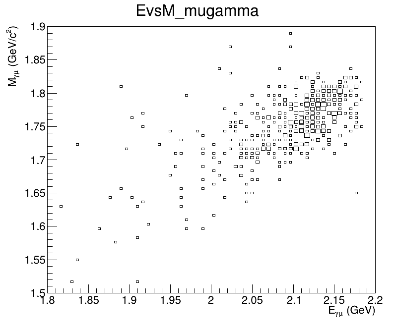

**说明**  
- `EvsM_mugamma`、对信号样本施加 final selection 后绘制，方块大小表示 bin 含量（BOX）。  


---

## Fig. 2 — 运动学分布：(a) $p_\mu$，(b) $E_\gamma$，(c) $\cos\theta_{\gamma\mu}$

论文中：(a) 信号 μ 子动量，(b) 信号光子能量，(c) 信号光子与 μ 子夹角余弦

**复现图像：**

| (a) $p_\mu$ (GeV/c) | (b) $E_\gamma$ (GeV) | (c) $\cos\theta_{\gamma\mu}$ |
|---------------------|----------------------|------------------------------|
| 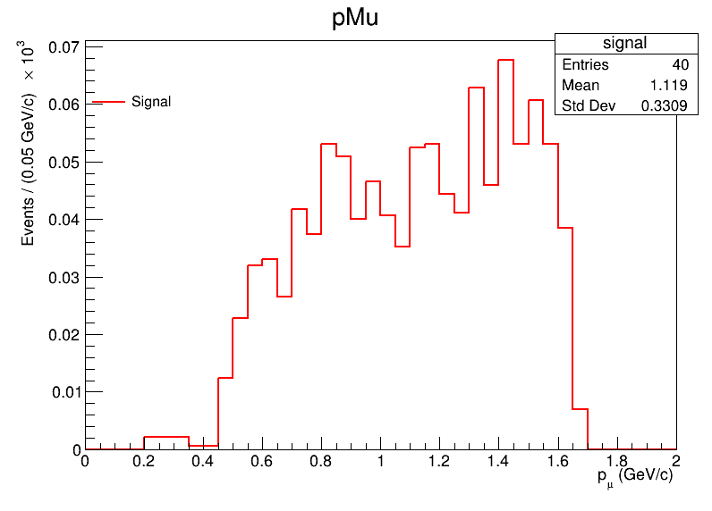 | 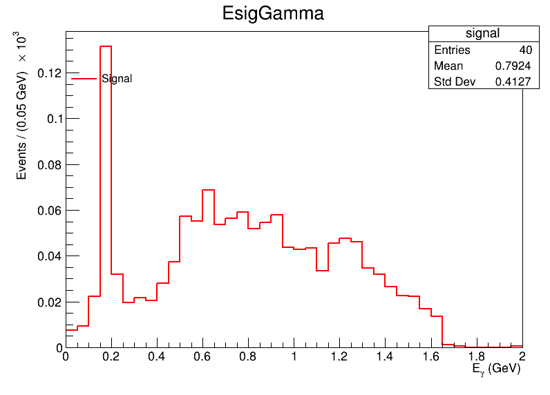 | 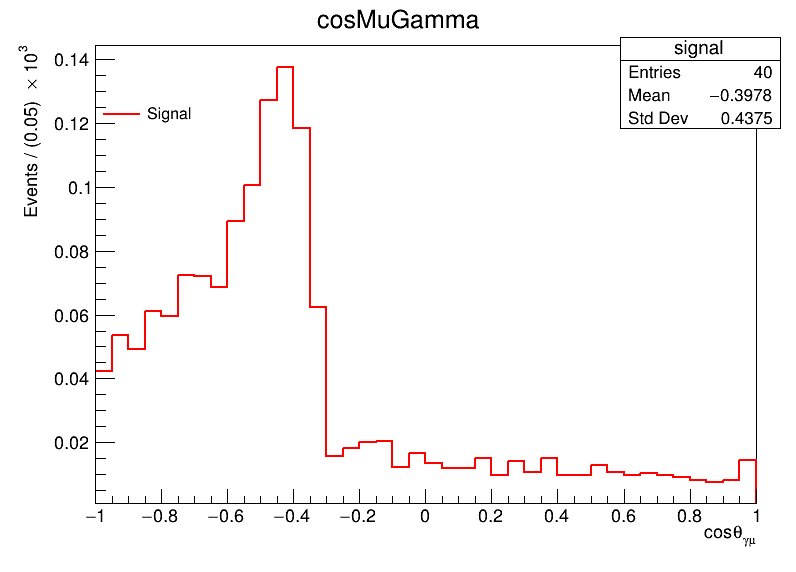 |

**说明**  
- 三张图均在“运动学选择、去掉对应变量 cut 的条件下绘制（即 drop 该变量），与论文 Fig. 2 对应。  
- 纵轴为 Events/(0.05 单位)×10³

---

## Fig. 3 — $e^+\bar\nu_e\nu_\tau$ 标记模式：(a) $\cos\theta_{\mathrm{sig}\,\gamma,\,\mathrm{tag}}$，(b) $p_{\mathrm{tag}}$，(c) $E_{\mathrm{miss}}$

论文中：$e^+\bar\nu_e\nu_\tau$ 标记下，信号与双 τ 本底的对比；(a) 信号光子与标记带电径迹夹角余弦，(b) 标记带电径迹动量，(c) 丢失能量。

**复现图像：**

| (a) $\cos\theta_{\gamma,\,\mathrm{tag}}$ | (b) $p_{\mathrm{tag}}$ (GeV/c) | (c) $E_{\mathrm{miss}}$ (GeV) |
|------------------------------------------|---------------------------------|--------------------------------|
| 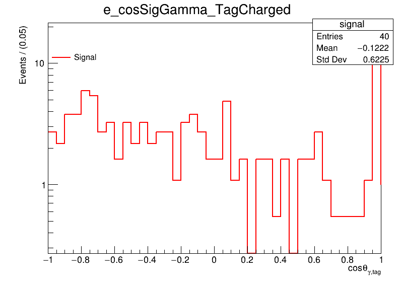 | 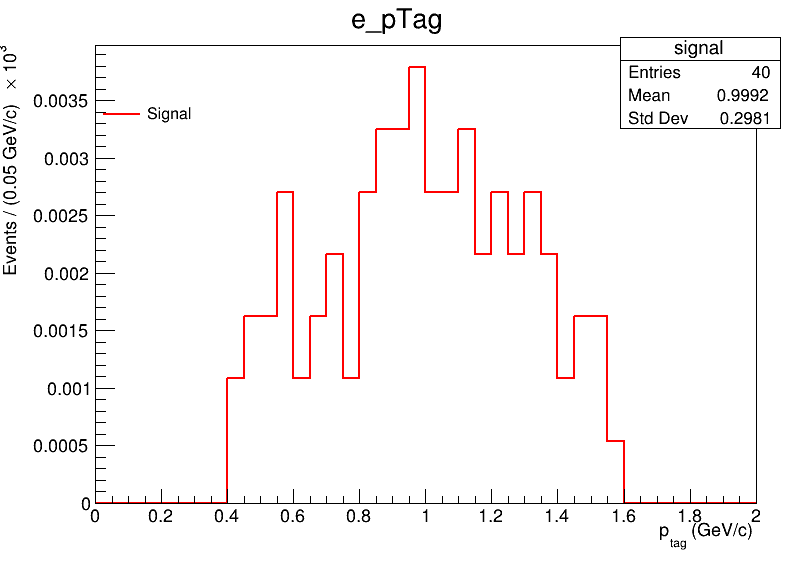 | 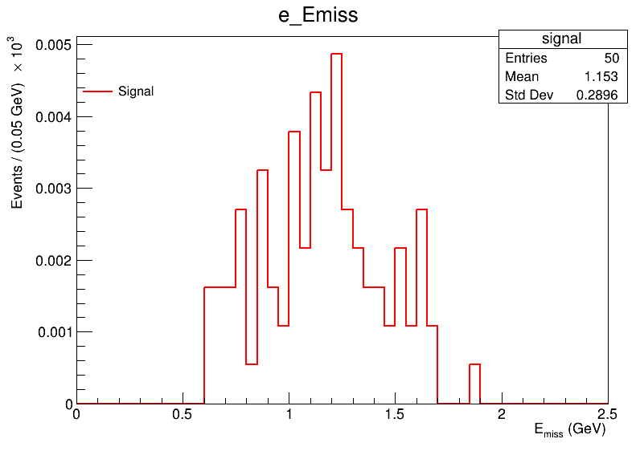 |

**说明**  
- 仅 e-tag（tagMode=1）事例，并施加与论文 Table 1 一致的 cut。  


---

## Fig. 4 — $\pi^+\bar\nu_\tau$ 标记模式：(a) $E_{\mathrm{miss}}$，(b) $|\cos\theta_{\mathrm{miss}}|$，(c) $E_{\mathrm{sig}\,\gamma}$，(d) $M^2_{\mathrm{miss}}$


**复现图像：**

| (a) $E_{\mathrm{miss}}$ | (b) $\lvert\cos\theta_{\mathrm{miss}}\rvert$ | (c) $E_{\mathrm{sig}\,\gamma}$ | (d) $M^2_{\mathrm{miss}}$ |
|-------------------------|-------------------------------------|----------------------------------|----------------------------|
| 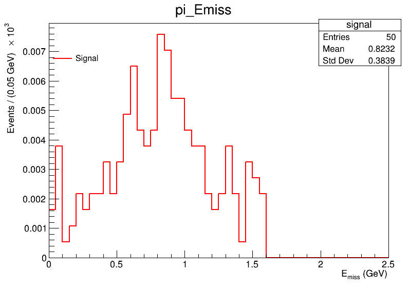 | 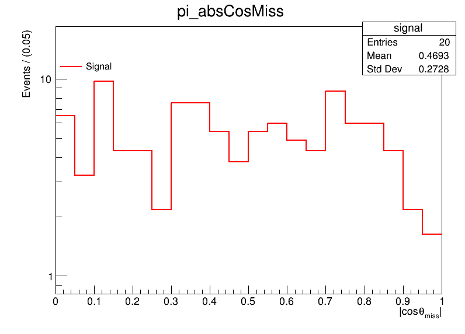 | 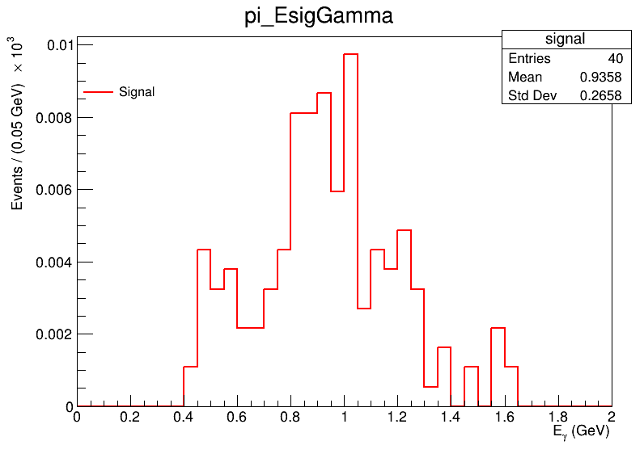 | 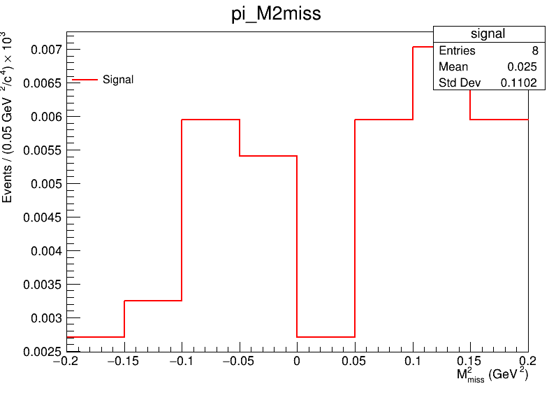 |

**说明**  
- 仅 π-tag（tagMode=2）事例，cut 与 Table 1 一致（除图中被 drop 的变量）。  
- (b) 为对数纵轴。若 $M^2_{\mathrm{miss}}$ 峰位或本底形状与论文有出入，可能与 $\pi^0$ 重建或 missing 四动量定义有关?

---

## Fig. 5 — $\pi^+\pi^0\bar\nu_\tau$ 标记模式：(a) $M^2_{\mathrm{miss}}$，(b) $\cos\theta_{\mathrm{hel}}$，(c) $|\cos\theta_{\mathrm{miss}}|$

论文中：(a)(b) 双 τ 本底，(c) 强子本底中 missing momentum 方向。

**复现图像：**

| (a) $M^2_{\mathrm{miss}}$ | (b) $\cos\theta_{\mathrm{hel}}$ | (c) $\lvert\cos\theta_{\mathrm{miss}}\rvert$ |
|---------------------------|----------------------------------|-------------------------------------|
| 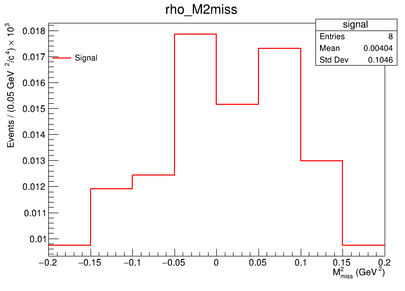 | 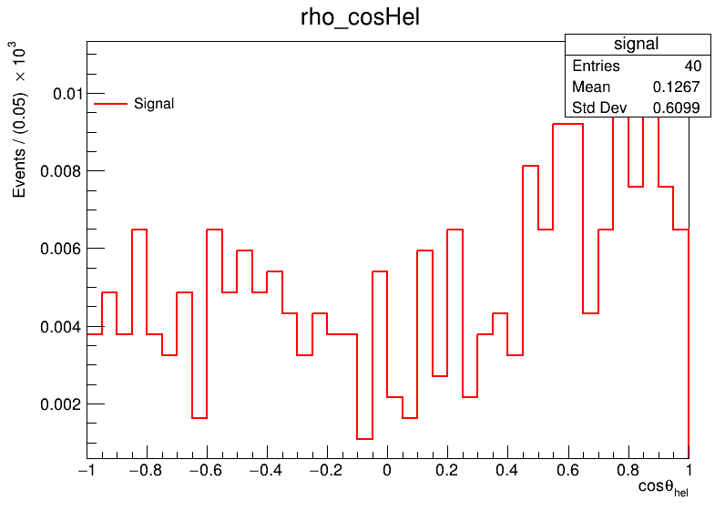 | 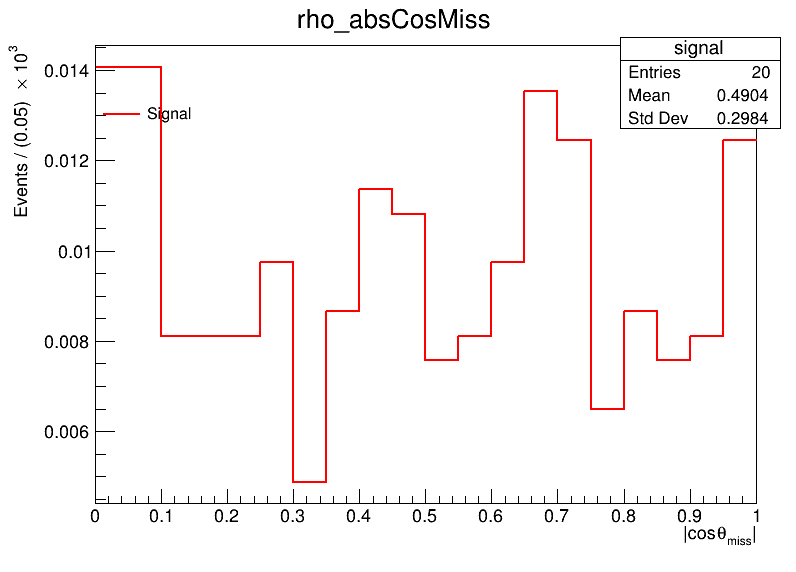 |

**说明**  
- 仅 ρ-tag（tagMode=3，即 $\pi^{+} \pi^0 \bar \nu_ \tau$）事例。  
- 

---


## 目录与文件对应关系


```
plotting/output/
├── EvsM_mugamma_signal.png    # Fig. 1
├── EvsM_mugamma_dimu.png
├── EvsM_mugamma_ditau.png
├── EvsM_mugamma_had.png
├── pMu.png                    # Fig. 2(a)
├── EsigGamma.png              # Fig. 2(b)
├── cosMuGamma.png             # Fig. 2(c)
├── e_cosSigGamma_TagCharged.png   # Fig. 3(a)
├── e_pTag.png                    # Fig. 3(b)
├── e_Emiss.png                   # Fig. 3(c)
├── pi_Emiss.png                  # Fig. 4(a)
├── pi_absCosMiss.png             # Fig. 4(b)
├── pi_EsigGamma.png              # Fig. 4(c)
├── pi_M2miss.png                 # Fig. 4(d)
├── rho_M2miss.png                # Fig. 5(a)
├── rho_cosHel.png                # Fig. 5(b)
└── rho_absCosMiss.png            # Fig. 5(c)
```

